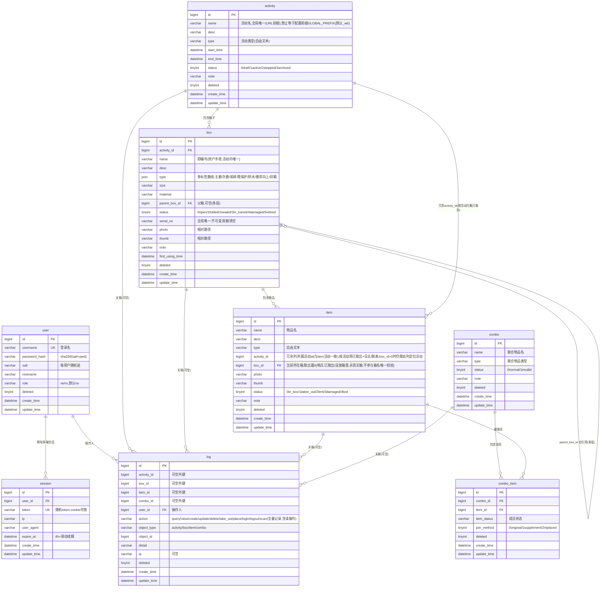
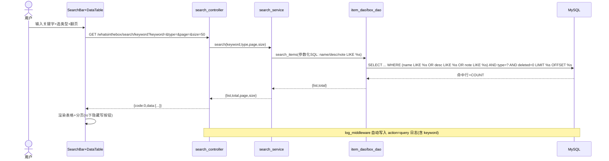
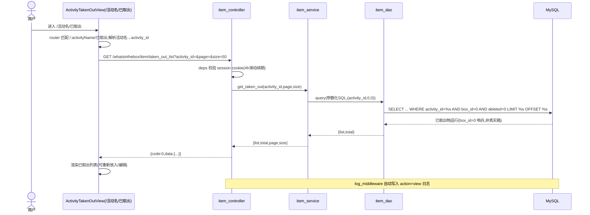
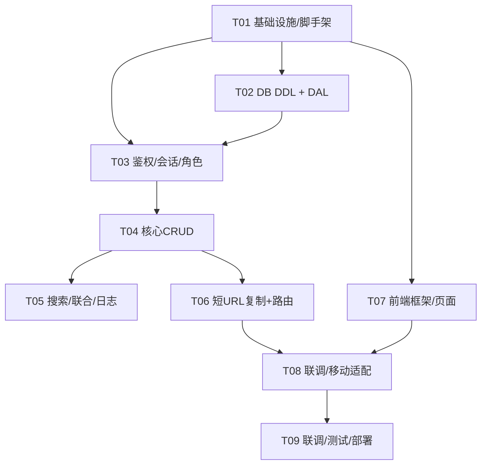

# 「箱子里面有什么（WhatsInTheBox）」后台管理系统 — 开发计划（系统架构设计 + 任务分解）v4（最终实现版）

> 文档性质：开发计划 / 系统架构设计（本阶段仅设计、不写代码）
> 作者：架构师 高见远（Gao）
> 基准文件 1：`/Users/poiop/Project/WhatsInTheBox/prototype_plan.md`（**源真文件，本计划未做任何修改**，仅引用并提异议）
> 基准文件 2：`/Users/poiop/Project/WhatsInTheBox/docs/feasibility-analysis.md`（可行性分析，开放问题含 #51 均已闭环）
> 决策依据 3：`/Users/poiop/Project/WhatsInTheBox/prototype_plan.patched.md`（用户逐条拍板的 patch 候选，本 v2 已全量同步，v3 据其文末 12 项下游清单 + #51 最终确认收尾）
> 版本说明：**v4 = 在 v3（#51 闭环、全局页前缀定为「保留字 `/_wb/`」）基础上，并入用户最终敲定的 3 项细化**：
> ① **全局页前缀可配置**——不再硬编码 `/_wb`，改为配置项：前端 `.env` 的 `VITE_GLOBAL_PREFIX`、后端 `settings` 的 `GLOBAL_PREFIX`、nginx 分流判定引用同一配置值（三处均默认 `_wb`、可随时改）；活动名全局唯一且**禁止等于该前缀（值取自配置）**。
> ② **日志 action 全量记录（含读操作）**——`query`/`view`/`scan` 等读操作也全部落库，便于追溯查询/扫码历史；数据量大后的 TTL 过期 / 按时间分表 / 迁移独立日志库为后续可选优化，不在本期。
> ③ **已取出按活动归集**——`item` 表新增 `activity_id` 冗余列；`box_id = 0` 作为保留哨兵表示「已取出 / 没放箱里」（非真实箱、不占箱列表、不参与箱名唯一校验）；取出置 `box_id=0` + `status=taken_out` + `activity_id` 保留；「已取出」列表改为按活动归集（`box_id=0 AND activity_id=:活动`），URL 形如 `/活动名/已取出`，**不再使用全局 `/_wb/taken-out`**。
> 语言：简体中文

---

## 1. 实现方案总览 + 框架选型

### 1.1 已确认技术栈（复述原型文件，强制遵守）

| 层 | 选型 | 说明 |
|---|---|---|
| 前端 | Vue 3 + Vite + TypeScript + npm + ant-design-vue | 支持手机访问（响应式） |
| 后端 | Python 3.12 + FastAPI + venv + pip + pymysql | 路由格式 `module_name/controller_name/action_name`，`module_name` 固定 `whatsinthebox` |
| 数据访问 | 不用 ORM，手写**参数化 SQL**（数据通过 `data` 传参），禁止字符串拼接 | 占位符用 **`%s`**（非 `?`，pymysql 仅支持 `%s`，已定稿） |
| 存储 | MySQL（**惰性连接 + 自管连接，不使用连接池**），连接参数写入 `.env`（不入库），提供 `.env.example` | 字符集 `utf8mb4` + `utf8mb4_general_ci` |
| 分层 | 后端 controller / service / dao 三层；前后端目录分离、分别启动 | — |
| 登录 | 有登录界面、无注册界面；cookie **只存随机 token**；可多端登录 | 密码用 `sha256(每用户随机盐)` |
| 角色 | `user` 表新增 `role`：`rw`（读写）/ `ro`（只读），前后端双重校验 | 管理员默认 `rw` |
| 通用字段 | 每个表都含 `deleted`（unsigned tinyint 逻辑删除）、`create_time`、`update_time`（on update）；时区 `Asia/Shanghai` | — |
| URL | **活动名即前缀**：`/活动名`、`/活动名/箱子名`（如 `/2026trip/A01`）、`/活动名/xxx-list`、`/活动名/已取出`；全局页用**可配置前缀**（来自 `VITE_GLOBAL_PREFIX`/`GLOBAL_PREFIX`，默认 `_wb`，可随时改）；nginx 按「首段是否等于该配置值」分流 | 活动名全局唯一且**禁止等于该前缀（值取自配置，默认 `_wb`）**（#51 已确认并细化） |
| 二维码 | **删除**：仅提供「复制 URL」按钮，由用户自行生成二维码 | 无后端二维码生成/导出 |
| 页面风格 | 原生/普通样式、深浅色主题、黑体中文、过渡/呼吸/淡入淡出动效、禁止 emoji、移动端响应式 | — |

### 1.2 关键技术风险的正面回应（R1~R11，已据 patch 定稿）

| # | 风险 | 本计划采用方案（v4 定稿） |
|---|---|---|
| R1 | pymysql 同步阻塞事件循环 | **DB 路由统一用普通 `def` 端点**（FastAPI 自动丢进线程池）；部署 **单实例 uvicorn 多 worker**；DAL 仅同步接口。**不使用连接池**（惰性连接 + 自管连接，`ping(reconnect=True)` 兜底）。 |
| R2 | 加盐 hash cookie 伪造/会话固定 | cookie 只存**随机 token**（`secrets.token_urlsafe`）；`HttpOnly + Secure + SameSite=Lax`；**有效期 4 小时 + 滑动续期**（任一已鉴权请求即重置）；token↔user 落 `session` 表。 |
| R3 | 多端登录无 Redis | session 落 MySQL `session` 表，同一用户多记录 = 多端；登出仅清当前 session，其他端照常可用。 |
| R4 | 二维码生成方 | **已删除**：无后端二维码生成，仅前端「复制 URL」按钮；用户拿 URL 自行生成。 |
| R5 | URL 编码/重名 | 活动名/箱子名作路径段统一 `encodeURIComponent`；服务端解码后**精确匹配**（区分大小写、不做 slug、不做模糊）；活动名全局唯一且**禁止等于配置前缀 GLOBAL_PREFIX（默认 `_wb`，值取自配置）**，从源头消除跨活动冲突与保留字冲突。 |
| R6 | 照片存储 | 本地 `uploads/` 目录 + DB 存**相对路径**；Pillow 重渲染压缩 + 生成 thumb；支持 jpg/png/webp，HEIC 经 `pillow-heif` 转 jpg；≤5MB；须 `rw` 角色。 |
| R7 | ant-design-vue 移动端 | viewport + 响应式断点 + 触控区放大 + 窄屏隐藏次要列；关键页定制。 |
| R8 | 软删 + 唯一约束冲突 | 唯一性放**应用层**（写入前 `SELECT ... AND deleted=0` 查重）；不建含 `deleted` 的 DB 唯一索引；软删记录释放的名称/串号可重用。`box_id=0` 哨兵非真实箱，不参与箱名唯一校验。 |
| R9 | 枚举/日志未定 | 全部定稿：status/join_method = `unsigned tinyint` + 列 `COMMENT`；log 表按新结构重写（见 §3.1），**action 全量记录（含读操作 query/view/scan）**。 |
| R10 | 单/多实例 | **单实例**部署；session 已落库，多实例亦安全。 |
| R11 | 备份 | `mysqldump`（DB）+ `rsync`（`uploads/`）双脚本，手动/cron，MVP 不内置调度。 |

### 1.3 前后端目录分离与启动

- **后端**：`backend/` 内 `venv` + `pip install -r requirements.txt`；启动 `uvicorn app.main:app --host 0.0.0.0 --port 8000 --workers 4`（开发 `--reload` 单 worker）。
- **前端**：`frontend/` 内 `npm install`；开发 `npm run dev`（默认 5173）；构建 `npm run build`（`dist/`）。
- **API 前缀**：后端 `/whatsinthebox/...`；前端 SPA 用户 URL 挂在 `/活动名/...`（及全局页 `/{GLOBAL_PREFIX}/...`，前缀来自配置，默认 `_wb`）。开发期 Vite `server.proxy` 将 `/whatsinthebox` 代理到 `http://localhost:8000`；前端 `axios` 的 `baseURL = /whatsinthebox`。
- **前端用户 URL 两段式**：
  - 活动页：`/活动名`、`/活动名/箱子名`、`/活动名/xxx-list`、`/活动名/已取出`（活动名是动态首段，全局唯一）。
  - 全局页：可配置前缀（来自 `VITE_GLOBAL_PREFIX`/`GLOBAL_PREFIX`，默认 `_wb`）下的固定路由（登录 `/{前缀}/login`、活动列表 `/{前缀}/activities`、联合物品 `/{前缀}/combos`、日志 `/{前缀}/logs`、搜索 `/{前缀}/search`、各 edit `/{前缀}/.../edit/:id?`）。**「已取出」不再有全局页，改挂活动内 `/活动名/已取出`**。

### 1.4 nginx 分流（v4：活动名前缀 + 可配置保留字前缀，默认 `_wb`，值取自 GLOBAL_PREFIX）

- **后端 API**：`location /whatsinthebox/ { proxy_pass http://127.0.0.1:8000/whatsinthebox/; ... }`（与前端页面互不干扰）。
- **前端 SPA（History 模式 fallback）**：`location / { root /path/to/frontend/dist; try_files $uri $uri/ /index.html; }`
  - nginx 按「首段路径是否等于**配置前缀 GLOBAL_PREFIX（默认 `_wb`，值来自配置，前端/后端/nginx 三处须一致）**」分流：
    - 首段**等于该配置值** → 落入全局页 SPA（如 `/_wb/login`、`/_wb/activities`、`/_wb/combos`、`/_wb/logs`）。
    - 首段**不等于该配置值** → 视为活动名 → 由前端路由解析 `/活动名`、`/活动名/箱子名`、`/活动名/已取出`，子箱钻取同构。
  - 因活动名是动态路径段且全局唯一，采用**统一 SPA fallback**，无需为每活动配独立 `location`；全局页前缀为 SPA 内部静态路由前缀（同样落入 SPA fallback，由前端 `router` 先注册 `/{GLOBAL_PREFIX}/*` 静态段、再注册 `/:activityName` 参数段）。
- **活动名全局唯一，且禁止等于配置前缀 GLOBAL_PREFIX（应用层 + seed 双重校验，值取自配置）**，从源头消除「活动名与保留字冲突」导致的路由歧义。URL 段统一 `encodeURIComponent`，服务端解码后精确匹配。
- **配置一致性要求**：全局前缀在「前端 `VITE_GLOBAL_PREFIX`、后端 `GLOBAL_PREFIX`、nginx 分流判定值」三处必须一致；修改前缀时三处同步调整（建议以环境变量 / 配置注入 nginx，避免硬编码）。

---

## 2. 文件列表及相对路径

### 2.1 后端 `backend/`

```
backend/
├── .env.example                # DB 连接、cookie 名/有效期/滑动续期、ADMIN_USER/ADMIN_PASS、GLOBAL_PREFIX(默认 _wb,可配置)
├── .env                        # 本地真实配置（不入库、不提交）
├── requirements.txt            # Python 依赖（无 DBUtils、无 qrcode；新增 pillow-heif）
├── run.py                      # 启动入口（uvicorn 多 worker）
├── seed.py                     # 初始化首个管理员（读 .env ADMIN_USER/ADMIN_PASS 或交互创建）；含「活动名≠GLOBAL_PREFIX(值取自配置)」校验
├── backup_db.sh                # mysqldump 备份脚本
├── backup_uploads.sh           # rsync 备份 uploads/ 脚本
├── app/
│   ├── __init__.py
│   ├── main.py                 # FastAPI 实例、挂载各 controller、CORS、全局异常 → 统一响应
│   ├── core/
│   │   ├── config.py           # 读 .env（pydantic-settings）；新增 GLOBAL_PREFIX 配置项（默认 _wb，可配置）
│   │   ├── db.py               # MySQL 惰性连接 + 自管连接（无池），ping(reconnect=True)
│   │   ├── security.py         # 密码 sha256(盐+密码)、随机 token 生成
│   │   ├── deps.py             # 鉴权依赖：解析 cookie→校验 session→注入 current_user（含 role）
│   │   ├── permission.py       # require_role('rw') 校验，无权限抛 1003
│   │   └── response.py         # 统一响应 {code,msg,data} 与辅助函数
│   ├── middleware/
│   │   └── exception_handler.py# 全局异常 → 统一响应；SQL/校验/权限错误码映射
│   │   └── log_middleware.py   # 读操作自动落库：拦截 query/view/scan 等读请求写入 log（全量记录）
│   ├── routers/whatsinthebox/
│   │   ├── auth_controller.py     # login / logout / change_password
│   │   ├── activity_controller.py # create/update/delete/list/detail/toggle_status
│   │   ├── box_controller.py       # create/update/delete/list/detail/fold/tree
│   │   ├── item_controller.py      # create/update/delete/list/detail/take_out/taken_out_list(按 activity_id)
│   │   ├── combo_controller.py     # 联合物品 create/update/delete/list/detail/add_item/remove_item
│   │   ├── log_controller.py       # list / detail
│   │   ├── search_controller.py    # keyword（后端 SQL 模糊搜索）
│   │   └── upload_controller.py    # 照片上传（须 rw；jpg/png/webp，HEIC→jpg，≤5MB）
│   ├── services/
│   │   ├── auth_service.py     # 登录校验、登出、改密、session 管理、角色
│   │   ├── activity_service.py # CRUD、活动名全局唯一+活动名≠GLOBAL_PREFIX 应用校验(值取自配置)、状态切换
│   │   ├── box_service.py      # CRUD、箱名活动内唯一校验、折叠（无空箱硬校验）、层级钻取、serial_no 不可变/软删清空
│   │   ├── item_service.py     # CRUD、取出（box_id=0 哨兵+status=taken_out+activity_id 保留）、级联约束
│   │   ├── combo_service.py    # 联合物品及成员管理
│   │   ├── log_service.py      # 日志全量写入(含读操作 query/view/scan)/查询
│   │   ├── search_service.py   # 关键字/筛选搜索聚合
│   │   └── file_service.py     # 上传落盘、Pillow 重渲染+缩略图、HEIC 转 jpg
│   ├── dao/
│   │   ├── base_dao.py         # 通用 query/execute/insert/soft_delete/分页；默认追 deleted=0；动态条件「片段+参数」
│   │   ├── user_dao.py
│   │   ├── session_dao.py
│   │   ├── activity_dao.py
│   │   ├── box_dao.py
│   │   ├── item_dao.py         # 取出置 box_id=0 哨兵；taken_out_list 按 box_id=0 AND activity_id 过滤
│   │   ├── combo_dao.py
│   │   ├── combo_item_dao.py
│   │   └── log_dao.py
│   ├── models/
│   │   ├── common.py           # PageReq/PageResp/BaseResp/错误码
│   │   ├── user.py
│   │   ├── activity.py
│   │   ├── box.py
│   │   ├── item.py             # 含 activity_id 冗余列、box_id(0=哨兵)
│   │   ├── combo.py
│   │   └── log.py
│   ├── utils/
│   │   ├── time_util.py        # Asia/Shanghai 时区
│   │   └── file_util.py        # 上传保存、Pillow 重渲染+缩略图、HEIC 解码
│   └── sql/
│       └── init_db.sql         # DDL（枚举 unsigned tinyint + COMMENT，utf8mb4；item 含 activity_id）
└── tests/
```

### 2.2 前端 `frontend/`

```
frontend/
├── index.html
├── package.json
├── tsconfig.json
├── tsconfig.node.json
├── vite.config.ts              # /whatsinthebox 代理
├── .env.example                # VITE_API_BASE=/whatsinthebox，VITE_GLOBAL_PREFIX=_wb（可配置，默认 _wb）
├── src/
│   ├── main.ts
│   ├── App.vue
│   ├── api/
│   │   ├── request.ts          # axios 实例、baseURL、拦截器、401→跳登录、解包统一响应
│   │   ├── auth.ts
│   │   ├── activity.ts
│   │   ├── box.ts
│   │   ├── item.ts
│   │   ├── combo.ts
│   │   ├── log.ts
│   │   ├── search.ts
│   │   └── upload.ts
│   ├── router/
│   │   └── index.ts            # 先注册 /{GLOBAL_PREFIX}/* 静态段（前缀来自 VITE_GLOBAL_PREFIX，默认 _wb），再注册 /:activityName 参数段（History 模式）
│   ├── store/
│   │   ├── index.ts
│   │   ├── user.ts             # 登录态、token、user、role
│   │   └── theme.ts
│   ├── views/
│   │   ├── LoginView.vue            # /{前缀}/login
│   │   ├── ActivityListView.vue     # /{前缀}/activities
│   │   ├── ComboListView.vue        # /{前缀}/combos
│   │   ├── LogListView.vue          # /{前缀}/logs
│   │   ├── SearchView.vue           # /{前缀}/search?keyword=
│   │   ├── ActivityTakenOutView.vue # /:activityName/已取出（box_id=0 且 activity_id=活动 的已取出物品，按活动归集）
│   │   ├── ActivityView.vue         # /:activityName（箱子列表，含子箱钻取行）
│   │   ├── BoxView.vue              # /:activityName/:boxName（物品列表，含子箱特殊行）
│   │   ├── ActivityEditView.vue     # /{前缀}/activity/edit/:id?
│   │   ├── BoxEditView.vue          # /:activityName/box/edit/:id?
│   │   ├── ItemEditView.vue         # /:activityName/item/edit/:id?
│   │   ├── ComboEditView.vue        # /{前缀}/combo/edit/:id?
│   │   └── NotFoundView.vue
│   ├── components/
│   │   ├── layout/
│   │   │   ├── AppHeader.vue        # 顶栏：标题、复制 URL 按钮、主题切换、登出
│   │   │   └── AppFooter.vue
│   │   ├── common/
│   │   │   ├── SearchBar.vue
│   │   │   ├── DataTable.vue        # 操作列按 role 隐藏写按钮
│   │   │   ├── Pagination.vue       # 每页 50
│   │   │   ├── ThemeToggle.vue
│   │   │   ├── CopyUrlButton.vue    # 复制当前完整 URL（含配置前缀/活动名，替代原 QrCodeModal）
│   │   │   └── TagFilter.vue        # 箱子 type 多标签「包含」筛选
│   │   ├── activity/
│   │   │   ├── ActivityCard.vue
│   │   │   └── ActivityForm.vue
│   │   ├── box/
│   │   │   ├── BoxCard.vue
│   │   │   ├── BoxForm.vue
│   │   │   └── BoxBreadcrumb.vue    # 父箱面包屑（多层钻取）
│   │   ├── item/
│   │   │   ├── ItemCard.vue
│   │   │   └── ItemForm.vue
│   │   └── combo/
│   │       ├── ComboCard.vue
│   │       └── ComboForm.vue
│   ├── styles/
│   │   ├── variables.css
│   │   ├── global.css
│   │   └── animations.css
│   ├── types/index.ts
│   └── utils/
│       ├── theme.ts
│       ├── format.ts           # 时间原样展示（不转时区）
│       └── url.ts              # encodeURIComponent 拼装/解析活动名·箱子名；全局页前缀来自 VITE_GLOBAL_PREFIX（默认 _wb）
└── tests/
```

> **v2→v3 文件清单变动**：v2 已移除 `qrcode_controller.py` / `qrcode_service.py` / `utils/qrcode_util.py` / `components/common/QrCodeModal.vue` / `utils/slug_util.py`，新增 `seed.py`、`backup_db.sh`、`backup_uploads.sh`、`upload_controller.py`、`file_service.py`、`CopyUrlButton.vue`、`TagFilter.vue`、`TakenOutListView.vue`、`SearchView.vue`、`core/permission.py`。**v3（#51 闭环）**：全局页路由前缀由占位 `/_admin/` 正式定为保留字 `/_wb/`，仅涉及 `router/index.ts`、`AppHeader` 复制 URL 入口与 `.env.example` 的 `VITE_GLOBAL_PREFIX` 取值调整，以及 `seed.py` / `activity_service.py` 增加「活动名 ≠ `_wb`」校验；**无新增/删除文件**。
>
> **v4（3 项细化，相对 v3 的文件变动）**：① 全局前缀可配置——后端 `core/config.py` 增 `GLOBAL_PREFIX` 配置项、`.env.example` 增 `GLOBAL_PREFIX`、前端 `.env.example` 增 `VITE_GLOBAL_PREFIX`、新增 `middleware/log_middleware.py`（读操作自动落库），`router/index.ts` 静态段改为 `/{GLOBAL_PREFIX}/*`；`activity_service.py`/`seed.py` 校验「活动名≠GLOBAL_PREFIX（值取自配置）」。② 日志全量记录——`log_service.py`/`log_middleware.py` 标注全量写入（含读操作）。③ 已取出改活动内归集——`item` 表增 `activity_id` 冗余列（`item.py`/`init_db.sql`/`item_dao.py` 同步），`item_service.py` 取出置 `box_id=0` 哨兵；前端 `TakenOutListView.vue`（全局 `/_wb/taken-out`）改为 `ActivityTakenOutView.vue`（活动内 `/:activityName/已取出`），API 删除全局 `taken_out_list`、改为按 `activity_id` 过滤。**除以上外无增删其他文件。**

---

## 3. 数据结构与接口

### 3.1 数据库 ER 简图（Mermaid erDiagram，v4 已据 3 项细化更新）



> **v4 ER 图变动**：① 全局前缀可配置（无新增表/字段，仅 `activity.name` 注释改为「禁止等于配置前缀 GLOBAL_PREFIX」），并新增 `log_middleware` 概念（读操作自动落库）。② `log.action` 注释标注**全量记录（含读操作 query/view/scan）**。③ `item` 表新增 `activity_id` 冗余列（unsigned bigint，与所属活动一致）；`item.box_id` 注释改为「取出置 0（哨兵：已取出/没放箱里，非真实箱，不参与箱名唯一校验）」；新增 `activity ||--o{ item` 冗余归属关系（用于按活动归集已取出）。box 无 `code`（编号=name）；box.type 为 `json` 多标签；所有 status/join_method 为 `unsigned tinyint` + COMMENT；user 含 `role`；log 表含四个可空外键 + `action`/`object_type`/`object_id`；serial_no 标注软删清空；activity.name 标注「禁止等于配置前缀」。

### 3.2 后端 API 路由表（MVP，v4）

> 约定：读 GET（查询参数）；写 POST（JSON body）；登录 POST；除 `login` 外均需 cookie 有效 `session` token；**所有写接口需 `rw` 角色**（后端 `require_role` 二次校验，`ro` 返回 `1003`）。响应体 `{code,msg,data}`。后端路由统一 `/whatsinthebox/{controller}/{action}`，与前端用户 URL（`/活动名/...`、`/{GLOBAL_PREFIX}/...`）解耦，不受前缀可配置影响。
>
> **日志全量记录（含读操作）**：`log` 的 `action` 枚举（`query`/`view`/`create`/`update`/`delete`/`take_out`/`place`/`login`/`logout`/`scan`）**全部落库**，含读操作 `query`/`view`/`scan`。读接口（`box/detail`、`item/detail`、`item/list`、`search/keyword`、`box/tree`、`activity/detail` 等）由 `log_middleware` / 服务层在处理时自动写入对应 `action`，用于追溯查询/扫码历史。数据量大后的 TTL 过期 / 按时间分表 / 迁移独立日志库为后续可选优化，不在本期。

| controller | action | method | path | 入参（关键） | 出参 data | 鉴权/角色 |
|---|---|---|---|---|---|---|
| auth | login | POST | /whatsinthebox/auth/login | {username,password} | {token, user} | 否 |
| auth | logout | POST | /whatsinthebox/auth/logout | — | {} | 是/任意 |
| auth | change_password | POST | /whatsinthebox/auth/change_password | {old_pwd,new_pwd} | {} | 是/rw |
| activity | list | GET | /whatsinthebox/activity/list | page,size,keyword,type,status | {list,total,page,size} | 是/任意 |
| activity | detail | GET | /whatsinthebox/activity/detail | id 或 name | activity | 是/任意 |
| activity | create | POST | /whatsinthebox/activity/create | {name,desc,type,start_time,end_time,status,note} | {id} | 是/rw |
| activity | update | POST | /whatsinthebox/activity/update | {id,...} | {id} | 是/rw |
| activity | delete | POST | /whatsinthebox/activity/delete | {id} | {} | 是/rw |
| activity | toggle_status | POST | /whatsinthebox/activity/toggle_status | {id,status} | {} | 是/rw |
| box | list | GET | /whatsinthebox/box/list | activity_id,page,size,keyword,type,status | {list,total,...} | 是/任意 |
| box | detail | GET | /whatsinthebox/box/detail | activity_name + box_name | box+items | 是/任意 |
| box | tree | GET | /whatsinthebox/box/tree | activity_id | 层级（钻取用） | 是/任意 |
| box | create | POST | /whatsinthebox/box/create | {activity_id,name,type,size,...,parent_box_id} | {id} | 是/rw |
| box | update | POST | /whatsinthebox/box/update | {id,...} | {id} | 是/rw |
| box | delete | POST | /whatsinthebox/box/delete | {id} | {} | 是/rw |
| box | fold | POST | /whatsinthebox/box/fold | {id,status} | {} | 是/rw（无空箱硬校验） |
| item | list | GET | /whatsinthebox/item/list | box_id,page,size,keyword,type,status | {list,total,...} | 是/任意 |
| item | taken_out_list | GET | /whatsinthebox/item/taken_out_list | activity_id（或 activity_name）,page,size,keyword | {list,total}（box_id=0 AND activity_id=:活动） | 是/任意 |
| item | detail | GET | /whatsinthebox/item/detail | id | item | 是/任意 |
| item | create | POST | /whatsinthebox/item/create | {box_id,name,type,...,status} | {id} | 是/rw |
| item | update | POST | /whatsinthebox/item/update | {id,...} | {id} | 是/rw |
| item | delete | POST | /whatsinthebox/item/delete | {id} | {} | 是/rw |
| item | take_out | POST | /whatsinthebox/item/take_out | {id} | {}（box_id 置 0 哨兵 + status=taken_out + activity_id 保留） | 是/rw |
| combo | list | GET | /whatsinthebox/combo/list | page,size,keyword,type,status | {list,total,...} | 是/任意 |
| combo | detail | GET | /whatsinthebox/combo/detail | id | combo+items | 是/任意 |
| combo | create | POST | /whatsinthebox/combo/create | {name,type,status,note} | {id} | 是/rw |
| combo | update | POST | /whatsinthebox/combo/update | {id,...} | {id} | 是/rw |
| combo | delete | POST | /whatsinthebox/combo/delete | {id} | {} | 是/rw |
| combo | add_item | POST | /whatsinthebox/combo/add_item | {combo_id,item_id,item_status,join_method} | {} | 是/rw |
| combo | remove_item | POST | /whatsinthebox/combo/remove_item | {combo_item_id} | {} | 是/rw |
| log | list | GET | /whatsinthebox/log/list | page,size,action,object_type | {list,total,...} | 是/任意(rw 建议) |
| search | keyword | GET | /whatsinthebox/search/keyword | keyword,type,page,size | {items,total} | 是/任意 |
| upload | photo | POST | /whatsinthebox/upload/photo | file(multipart) | {path,thumb} | 是/rw |

> 注：二维码相关接口已**删除**（无 `qrcode/gen`）；「复制 URL」纯前端行为，不占接口。**全局 `/_wb/taken-out` 已移除**——「已取出」改为活动内接口 `item/taken_out_list`（按 `activity_id` 过滤 `box_id=0`）。`log` 表记录全部 action（含读操作 query/view/scan），由 `log_middleware` 自动落库。

### 3.3 前端路由表（v4：活动名前缀 + 可配置前缀 `{GLOBAL_PREFIX}`，默认 `_wb`；已取出改活动内）

| 路径 | View | 说明 | 鉴权/角色 |
|---|---|---|---|
| /{前缀}/login | LoginView | 登录（无注册） | 否 |
| /{前缀}/activities | ActivityListView | 活动列表（全局） | 是/任意 |
| /{前缀}/combos | ComboListView | 联合物品列表（全局） | 是/任意 |
| /{前缀}/logs | LogListView | 日志列表（全局，含读操作记录） | 是/任意(rw) |
| /{前缀}/search | SearchView | 跨活动关键字搜索 | 是/任意 |
| /:activityName | ActivityView | 活动详情（其下箱子列表，含子箱钻取行） | 是/任意 |
| /:activityName/:boxName | BoxView | 箱子详情（其下物品列表，含子箱特殊行） | 是/任意 |
| /:activityName/已取出 | ActivityTakenOutView | 活动内已取出物品（box_id=0 且 activity_id=活动，按活动归集） | 是/任意 |
| /{前缀}/activity/edit/:id? | ActivityEditView | 新建/编辑活动 | 是/rw |
| /:activityName/box/edit/:id? | BoxEditView | 新建/编辑箱子 | 是/rw |
| /:activityName/item/edit/:id? | ItemEditView | 新建/编辑物品 | 是/rw |
| /{前缀}/combo/edit/:id? | ComboEditView | 新建/编辑联合物品 | 是/rw |

> **v4 前端路由变动（相对 v3）**：① 全局页前缀由硬编码 `/_wb/` 改为**可配置前缀** `{GLOBAL_PREFIX}`（来自 `VITE_GLOBAL_PREFIX`，默认 `_wb`），如登录 `/_wb/login`、活动列表 `/_wb/activities`、联合物品 `/_wb/combos`、日志 `/_wb/logs`、搜索 `/_wb/search`，其余全局 edit 同构。② **「已取出」不再有全局页**——原 `/_wb/taken-out` 删除，改为活动内路由 `/:activityName/已取出`（`ActivityTakenOutView`），按 `box_id=0 AND activity_id=活动` 归集。③ 活动名**全局唯一且禁止等于配置前缀（值取自配置，默认 `_wb`）**（应用层 + seed 双重校验），前端 `router` 先注册 `/{GLOBAL_PREFIX}/*` 静态段、再注册 `/:activityName` 参数段；nginx 按「首段是否等于配置值」分流。URL 段统一 `encodeURIComponent`，服务端解码后精确匹配。`CopyUrlButton` 复制内容 = 完整前端 URL（含 `/活动名/箱子名`、`/活动名/已取出` 或 `/{前缀}/...`）；改名后旧 URL 失效（404），不做别名/重定向。

---

## 4. 程序调用流程（时序图）

### 4.1 扫码/打开箱子 URL（v4：URL 由用户自行生成二维码；前缀来自配置）

```mermaid
sequenceDiagram
    actor 用户
    participant 手机 as 手机(扫用户自印二维码)
    participant 前端 as 前端(/活动名/箱子名)
    participant nginx as nginx(SPA fallback+可配置前缀分流)
    participant API as FastAPI(/whatsinthebox)
    participant Svc as box_service
    participant Dao as box_dao/item_dao
    participant DB as MySQL

    用户->>手机: 扫描箱上二维码(内容=完整URL,用户自生成)
    手机->>前端: 打开 /活动名/箱子名
    前端->>nginx: 请求(首段非配置前缀→活动名→SPA fallback)
    nginx->>前端: 返回 index.html
    前端->>前端: router 先匹配/{GLOBAL_PREFIX}/*,再匹配/:activityName/:boxName
    前端->>API: GET /whatsinthebox/box/detail?activity_name=&box_name=
    API->>API: deps 校验 session cookie(4h滑动续期)
    API->>Svc: get_box_with_items(activity,box)
    Svc->>Dao: query(参数化SQL,(activity,box,0))
    Dao->>DB: SELECT ... WHERE name=%s AND deleted=0
    DB-->>Dao: 箱子+物品行(含子箱特殊行)
    Dao-->>Svc: 结果
    Svc-->>API: box + items
    API-->>前端: {code:0,data:{box,items}}
    前端->>前端: 渲染 BoxView(物品列表+钻取)
    前端-->>用户: 展示内容;提供「复制 URL」按钮(记录 view 日志)
```

### 4.2 登录（v4：4 小时 + 滑动续期；前缀来自配置）

```mermaid
sequenceDiagram
    actor 用户
    participant 前端 as LoginView(/前缀/login)
    participant API as auth_controller
    participant Svc as auth_service
    participant UDao as user_dao
    participant SDao as session_dao
    participant DB as MySQL

    用户->>前端: 输入账号密码
    前端->>API: POST /whatsinthebox/auth/login {username,password}
    API->>Svc: login(username,password)
    Svc->>UDao: get_by_username(username)
    UDao->>DB: SELECT ... WHERE username=%s AND deleted=0
    DB-->>UDao: user(row)
    Svc->>Svc: 校验 sha256(salt+password)==password_hash
    Svc->>Svc: token=secrets.token_urlsafe(32)
    Svc->>SDao: insert_session(user_id,token,expire_at=now+4h,ip,ua)
    SDao->>DB: INSERT INTO session(...)
    Svc-->>API: {token,user(含role)}
    API-->>前端: {code:0,data:{token,user}} + Set-Cookie: wb_session=token; HttpOnly; Secure; SameSite=Lax
    前端->>前端: store 存 token/user/role,按 role 控制写按钮
```

### 4.3 分页搜索（v4：后端 SQL；记录 query 日志）



### 4.4 查看活动内「已取出」列表（v4：按活动归集，box_id=0 哨兵）



---

## 5. 🚀 任务列表（有序、含依赖、按实现顺序，v4 已并入 3 项细化）

| 编号 | 任务名 | 产出（关键文件） | 依赖 | 工作量 |
|---|---|---|---|---|
| **T01** | 基础设施与工程脚手架 | 前后端骨架、`requirements.txt`（去 DBUtils/qrcode，加 pillow-heif）、`package.json`、`.env.example`（后端 `GLOBAL_PREFIX` 默认 `_wb`、前端 `VITE_GLOBAL_PREFIX` 默认 `_wb`，均可配置）、`seed.py` 占位、`backup_*.sh` 占位、nginx 样例（活动名 fallback + 可配置前缀分流，活动名≠`GLOBAL_PREFIX` 校验值取自配置） | — | S |
| **T02** | 数据库 DDL 与 DAL 层 | `sql/init_db.sql`（枚举 tinyint+COMMENT、box 无 code、box.type JSON、item.type 自由文本、item 含 `activity_id` 冗余列、log 新结构、user.role）、`core/db.py`（惰性+自管连接，无池）、`dao/base_dao.py`（参数化/`%s`/软删/分页/动态条件片段）、各 `dao/*` | T01 | M |
| **T03** | 鉴权/会话/角色模块 | `user`/`session` 表、`core/security.py`（sha256 盐）、`core/deps.py`（注入 role）、`core/permission.py`（`require_role`）、`auth_controller/service/dao`、`seed.py`（ADMIN_USER/PASS 初始化 + 活动名≠`GLOBAL_PREFIX` 校验，值取自配置）、`change_password` | T01,T02 | M |
| **T04** | 核心业务 CRUD（活动/箱子/物品） | 三套 controller+service+dao+models；箱名活动内唯一/活动名全局唯一+活动名≠`GLOBAL_PREFIX`（应用层，值取自配置）；`serial_no` 不可变+软删清空；折叠无空箱硬校验；取出（`box_id=0` 哨兵+`status=taken_out`+`activity_id` 保留）+「已取出」按活动归集列表（`box_id=0 AND activity_id=活动`）；父箱钻取行；照片上传（jpg/png/webp、HEIC→jpg、≤5MB、rw） | T03 | L |
| **T05** | 搜索/联合物品/日志 | `search`（后端 SQL LIKE）、`combo`+`combo_item`（join_method 枚举）、`log`（全量写入含读操作 query/view/scan + `log_middleware` 自动落库）、埋点 | T04 | M |
| **T06** | 短 URL 复制 + 路由对接（v4 缩减） | 前端 `CopyUrlButton.vue`（复制完整 URL）、`utils/url.ts`（encodeURIComponent 拼装/解析、全局前缀来自 `VITE_GLOBAL_PREFIX` 默认 `_wb`）、前端 `/活动名/...` + `/{前缀}/...` 路由（先 `{前缀}` 静态段后 `:activityName`）、nginx 可配置前缀分流定稿（**不含任何二维码生成**） | T04 | M |
| **T07** | 前端基础框架与页面 | 脚手架、`router`、`store(user/theme)`、`api/request.ts`、登录页（/{前缀}/login）、列表页（DataTable 按 role 隐藏写按钮）、编辑页、活动内已取出页（`/:activityName/已取出`，取代全局 `/_wb/taken-out`）、主题与动效、TagFilter（箱子多标签筛选） | T01 | L |
| **T08** | 前端联调 + 移动端响应式适配 | axios 联调各模块、ant-design-vue 移动适配、复制 URL 入口、钻取交互、ro 角色按钮禁用、已取出活动内归集交互 | T06,T07 | M |
| **T09** | 联调/测试/部署收尾 | 全链路联调、nginx 全量配置（活动名 fallback + 可配置前缀分流 + API 反代）、`backup_db.sh`(mysqldump)+`backup_uploads.sh`(rsync) 双脚本、上线检查清单、最小冒烟测试 | T08 | M |

**任务依赖图（Mermaid graph）：**



---

## 6. 依赖包列表

### 6.1 后端（`requirements.txt`，稳定版本，v4 调整）

| 包 | 版本（建议） | 用途 | v4 变动 |
|---|---|---|---|
| fastapi | >=0.110,<1.0 | Web 框架 | 不变 |
| uvicorn[standard] | >=0.29 | ASGI 多 worker | 不变 |
| gunicorn | >=21.2（可选） | 生产多进程管理 uvicorn worker | 不变 |
| pymysql | >=1.1.0 | MySQL 同步驱动 | 不变（占位符 `%s`） |
| ~~DBUtils~~ | — | ~~连接池~~ | **移除（不使用连接池）** |
| pydantic / pydantic-settings | >=2.6 | 校验与 `.env` 读取（含 `GLOBAL_PREFIX`） | 不变 |
| python-dotenv | >=1.0.0 | 读 `.env` | 不变 |
| Pillow | >=10.0 | 图片重渲染/缩略图 | 不变 |
| pillow-heif | >=0.1 | **HEIC→jpg 解码** | **新增** |
| python-multipart | >=0.0.9 | 文件上传 | 不变 |
| ~~qrcode~~ | — | ~~二维码生成~~ | **移除（二维码功能删除）** |
| (stdlib) hashlib / secrets | 内置 | 密码盐 hash、随机 token | 不变 |

### 6.2 前端（`package.json`，稳定版本，v4 调整）

| 包 | 版本（建议） | 用途 | v4 变动 |
|---|---|---|---|
| vue | ^3.4 | 框架 | 不变 |
| vue-router | ^4 | 路由（先注册 `/{GLOBAL_PREFIX}/*` 静态段，再注册 `/:activityName` 参数段） | 路由前缀改为可配置 |
| pinia | ^2 | 状态（user/theme/role） | 不变 |
| ant-design-vue | ^4 | UI | 不变 |
| axios | ^1.6 | HTTP（baseURL=/whatsinthebox） | 不变 |
| vite | ^5 | 构建 | 不变 |
| @vitejs/plugin-vue | ^5 | Vite 插件 | 不变 |
| typescript | ^5.4 | 类型 | 不变 |
| vue-tsc | ^2 | 类型检查 | 不变 |
| ~~@zxing/browser~~ | — | ~~扫码解码~~ | **移除（扫描由用户外部二维码完成，无需前端解码）** |

> 3 项细化**不引入任何新依赖**：全局前缀可配置仅用既有 `.env` 读取；日志全量记录复用既有 log 表/dao；已取出归集仅新增 `item.activity_id` 列与 `box_id=0` 哨兵约定，无新包。

---

## 7. 共享知识（跨文件约定，v4 全量更新）

1. **路由格式**：后端 API 固定 `/whatsinthebox/{controller}/{action}`；前端用户 URL = 活动页 `/活动名`、`/活动名/箱子名`、`/活动名/xxx-list`、`/活动名/已取出`，全局页用**可配置前缀**（来自 `VITE_GLOBAL_PREFIX`/`GLOBAL_PREFIX`，默认 `_wb`，可随时改）；活动名全局唯一且**禁止等于该前缀（值取自配置）**。
2. **HTTP 方法**：读（list/detail/search/tree/taken_out_list）= GET + 查询参数；写（create/update/delete/状态变更/登录/登出/改密/上传）= POST + JSON body（上传为 multipart）。
3. **参数化查询模板（强制）**：pymysql 占位符 **`%s`**（非 `?`）；参数以元组/字典经 `data` 传入；**禁止字符串拼接**；动态筛选走「条件片段 + 参数列表」拼装，值不入 SQL 文本。
   ```python
   sql = "SELECT * FROM box WHERE activity_id=%s AND name=%s AND deleted=0"
   rows = self.query(sql, (activity_id, name))
   sql = "SELECT * FROM item WHERE box_id=%s AND deleted=0 LIMIT %s OFFSET %s"
   rows = self.query(sql, (box_id, size, (page-1)*size))
   # 已取出(按活动归集): box_id=0 哨兵
   sql = "SELECT * FROM item WHERE activity_id=%s AND box_id=0 AND deleted=0 LIMIT %s OFFSET %s"
   rows = self.query(sql, (activity_id, size, (page-1)*size))
   ```
4. **统一响应体**：`{"code":0,"msg":"ok","data":{...}}`；列表 `data={list,total,page,size}`。
5. **错误码规范**：`0` 成功；`1001` 参数错误；`1002` 未登录/过期；`1003` 无权限（role 不足/ro 调写接口）；`2001` 资源不存在；`2002` 名称/串号重复（唯一性冲突）；`2003` 活动名等于配置前缀 `GLOBAL_PREFIX`（新建/改名被拒）；`5000` 服务器错误。**（注：`2003 非空箱不可折叠` 已删除——折叠不再有硬校验。）**
6. **时区**：连接时区 `Asia/Shanghai`，按上海时间存、按上海时间展示；前端 `format.ts` **原样显示、不做时区转换**，不提供自选时区。
7. **逻辑删除**：查询由 `base_dao` 默认追 `AND deleted=0`；删除统一软删 `UPDATE ... SET deleted=1, update_time=now()`；**箱子软删时一并清空 `serial_no`**（释放该串号）。`session` 表物理删除（登出/过期）。
8. **登录鉴权**：cookie 名 `wb_session`；值=随机 token；`HttpOnly + Secure + SameSite=Lax`；**有效期 4 小时，滑动续期**（任一已鉴权请求重置 `expire_at`）；`deps.py` 解析→查 `session`→注入 `current_user`（含 `role`）。
9. **角色校验**：`rw` 可全部写操作；`ro` 仅可登录/查看/搜索。**前后端双重生效**：前端 `DataTable` 按 `role` 隐藏写按钮；后端 `require_role('rw')` 对写接口二次校验，不足返回 `1003`。管理员默认 `rw`；无注册、无找回密码（seed 重设）。
10. **分页**：`page`(从1)、`size`(默认50,最大100)；返回 `total`。
11. **二维码/URL（v4）**：**不生成二维码**；页面提供「复制 URL」按钮（`CopyUrlButton`），内容=完整前端 URL（活动页如 `/活动名/箱子名`、活动内如 `/活动名/已取出`、全局页如 `/_wb/logs`，前缀来自配置）；改名后旧 URL 失效（404），**不做别名/重定向、不新增字段**。URL 段统一 `encodeURIComponent`，服务端解码后精确匹配。
12. **名称/串号唯一性（应用层）**：箱名（同活动内）、`serial_no`（全局）、活动名（全局）写入/改名前 `SELECT ... AND deleted=0` 查重；软删后可重用；不建含 `deleted` 的 DB 唯一索引。**额外约束：活动名禁止等于配置前缀 `GLOBAL_PREFIX`（默认 `_wb`，值取自配置）**（应用层 + seed 双重校验，见错误码 `2003`）；`box_id=0` 哨兵非真实箱，不参与箱名唯一校验。
13. **枚举/字段类型**：
    - 箱子 status：`0 open`/`1 folded`/`2 sealed`/`3 in_transit`/`4 damaged`/`5 retired`（`unsigned tinyint`+COMMENT）。
    - 物品 status：`0 in_box`/`1 taken_out`/`2 lent`/`3 damaged`/`4 lost`。
    - 活动 status：`0 draft`/`1 active`/`2 stopped`/`3 archived`。
    - 联合物品 status：`0 normal`/`1 invalid`；`join_method`：`0 original`/`1 supplement`/`2 replaced`。
    - **箱子 `type` = JSON 多标签数组**，预置 `主要/次要/易碎/需保护/防水/要求向上/旧箱`；筛选按「包含某标签」。
    - **物品 `type` = 自由文本**（不做字典、不做多标签）。
    - `log.action`（varchar）：`query/view/create/update/delete/take_out/place/login/logout/scan`（**全部枚举值均落库，含读操作 query/view/scan**，详见 #21）；`log.object_type`（varchar）：`activity/box/item/combo`。
    - **物品 `activity_id` = 冗余列**（unsigned bigint，与 item 所属活动一致），用于按活动筛已取出 + 日志/联表；`box_id=0` 哨兵时不依赖 box 即可定位活动。
14. **取出动作**：`item.take_out` = `box_id` 置 `0`（**哨兵**：表示「已取出 / 没放箱里」，非真实箱记录、不占箱列表、不参与箱名唯一校验）+ `status=taken_out` + **`activity_id` 保留原所属活动**；记录不删，可在「已取出」列表（`box_id=0 AND activity_id=:活动`，按活动归集）查到并可重新放入其他箱。`box_id=0` 非真实箱，不参与箱名唯一校验。
15. **折叠**（v4 反转）：仅状态标志（`status=folded`），**非空箱也可折叠**，前端提示不阻断；空箱判定（物品全部取出/删除）仅用于提示与展示。
16. **活动停止/归档**（v4 反转）：`stopped`/`archived` 后其下箱子/物品**仍可编辑**，停止仅状态标记，无写入限制。
17. **照片与文件存储**：存本地 `uploads/`，DB 仅存相对路径；上传经 Pillow 重渲染压缩 + 生成 thumb；允许 jpg/png/webp，**HEIC 经 `pillow-heif` 转 jpg**；单文件 ≤5MB；上传接口须 `rw`。
18. **备份**：`backup_db.sh`（mysqldump）+ `backup_uploads.sh`（rsync `uploads/`）双脚本，手动/cron，MVP 不内置调度。
19. **部署**：单实例 uvicorn 多 worker + nginx；DB 路由用普通 `def` 端点（R1 方案保留）。
20. **可配置前缀与全局页（#51 细化）**：全局页前缀来自 `VITE_GLOBAL_PREFIX`/`GLOBAL_PREFIX`（默认 `_wb`，可随时改）；nginx 按「首段是否等于该配置值」分流；前端 `router` 先注册 `/{前缀}/*` 静态段再注册 `/:activityName` 参数段；活动名全局唯一且禁止等于该前缀（值取自配置）；**前端 / 后端 / nginx 三处配置值须一致**。
21. **日志全量记录（含读操作）**：`log.action` 全部枚举值 `query`/`view`/`create`/`update`/`delete`/`take_out`/`place`/`login`/`logout`/`scan` **均落库**，含读操作 `query`/`view`/`scan`，用于追溯查询/扫码历史；由 `log_middleware` / 服务层在请求处理时自动写入（读接口如 `box/detail`、`item/detail`、`item/list`、`search/keyword`、`box/tree` 亦触发对应 action）。**数据量大后的 TTL 过期、按时间分表、迁移独立日志库均为后续可选优化，不在本期范围。**

---

## 8. ⚠️ 待明确事项（v4 — 全部已闭环）

> v2 已将 8.1/8.2 据 patch 闭环，仅留 #51 待拍板。**v3 据用户最终确认闭合 #51**（保留字前缀 `/_wb/`）。**v4 在 v3 基础上并入用户最终敲定的 3 项细化**（全局前缀可配置 / 日志全量记录 / 已取出按活动归集）。本章改为纯「已确认决策汇总」+「遗留闭环记录」，不再有任何开放阻塞。

### 8.1 已确认决策汇总（patch + #51 + v4 三项细化全量落地，工程师照此实现）

| 主题 | 最终决策 |
|---|---|
| 占位符 | `%s`（pymysql 不支持 `?`，已定稿） |
| 连接池 | **不使用**；惰性连接 + 自管连接，移除 DBUtils |
| URL 前缀 | **活动名即前缀**：`/活动名`、`/活动名/箱子名`、`/活动名/xxx-list`、`/活动名/已取出`；全局页用**可配置前缀**（来自 `VITE_GLOBAL_PREFIX`/`GLOBAL_PREFIX`，默认 `_wb`，可随时改）；nginx 按「首段是否等于该配置值」分流；活动名禁止等于该前缀（值取自配置） |
| 二维码 | **删除**；仅「复制 URL」按钮，内容=完整 URL；改名后旧码失效，**不做别名/重定向、不新增字段** |
| 箱子编号 | = `name` 字段，用户手填、可变、**活动内唯一**、系统不生成、无独立 `code` |
| 箱子 type | **JSON 多标签数组**，预置 7 标签（主要/次要/易碎/需保护/防水/要求向上/旧箱） |
| 箱子 status | 0 open/1 folded/2 sealed/3 in_transit/4 damaged/5 retired（tinyint+COMMENT） |
| 物品 type | **自由文本**（不做字典/多标签） |
| 物品 status | 0 in_box/1 taken_out/2 lent/3 damaged/4 lost |
| 物品取出 | `box_id` 置 `0`（哨兵：已取出/没放箱里，非真实箱）+ `status=taken_out` + `activity_id` 保留原活动；记录不删，「已取出」**按活动归集**（`box_id=0 AND activity_id=活动`），不再用全局 `/_wb/taken-out` |
| 物品 activity_id | `item` 表**新增冗余列**（unsigned bigint，与所属活动一致），用于按活动筛已取出 + 日志/联表；`box_id=0` 哨兵时仍需此列定位活动 |
| 活动 status | 0 draft/1 active/2 stopped/3 archived |
| 活动停止/归档 | 子资源**仍可编辑**（无只读限制） |
| 折叠 | 仅状态标志，非空箱也可折叠，只提示不阻断；空箱判定仅前端提示 |
| 联合物品 status | 0 normal/1 invalid |
| 物品联合方式 | 0 original/1 supplement/2 replaced |
| log 表 | id / activity_id / box_id / item_id / combo_id（四个可空外键）/ user_id / `action`(varchar) / `object_type`(varchar) / `object_id` / detail / ip / 三通用字段；**实质只追加、全量记录（含读操作 query/view/scan）**；数据量大后 TTL/分表/迁库为后续可选优化 |
| 日志动作范围 | **全部 action 落库**，含读操作 `query`/`view`/`scan`（由 `log_middleware` 自动写入），用于追溯查询/扫码历史 |
| cookie | 只存随机 token；`HttpOnly+Secure+SameSite=Lax`；**4 小时 + 滑动续期** |
| 角色 | `user` 新增 `role`：`rw`/`ro`；`ro` 只读（可登录/查看/搜索，不可写）；**前后端双重校验（错误码 1003）**；管理员默认 `rw` |
| 初始管理员 | `seed.py` 或 `.env` 的 `ADMIN_USER`/`ADMIN_PASS`；无注册；无找回密码 |
| 多端登录 | 允许；无设备管理页/无「登出全部」；登出清当前 session |
| serial_no | 用户手填唯一串号，**不可变、不联动**；**软删时清空释放** |
| 唯一约束 | 箱名(活动内)/串号(全局)/活动名(全局) 走**应用层校验**；软删后可重用；活动名额外禁止等于配置前缀 `GLOBAL_PREFIX`（值取自配置） |
| 可配置前缀 | 全局页 URL 前缀**可配置**（前端 `VITE_GLOBAL_PREFIX`、后端 `GLOBAL_PREFIX`，默认 `_wb`，可随时改）；三处配置值须一致；活动名**禁止等于该前缀（值取自配置）**（应用层 + seed 校验），nginx 按该前缀分流 |
| 照片 | 本地 `uploads/`，DB 存相对路径；Pillow 重渲染+缩略图；上传 jpg/png/webp；**HEIC 经 `pillow-heif` 转 jpg**；≤5MB；须 `rw` |
| 字符集 | `utf8mb4` + `utf8mb4_general_ci` |
| 时区 | 连接 `Asia/Shanghai`，按 SH 存/展示，前端原样不转换 |
| 搜索筛选 | 全后端 SQL；`LIKE` 参数化 `name`/`desc`/`note`；`type`/`status` 走 `WHERE`；箱子 `type` JSON 按「包含」过滤；分页 SQL 层每页 50 |
| 部署 | 单实例 uvicorn 多 worker + nginx；DB 路由用 `def` 端点 |
| 备份 | `mysqldump`(DB) + `rsync`(`uploads/`) 双脚本，手动/cron，MVP 不内置调度 |
| 父箱嵌套 | 多层嵌套；子箱在父箱物品列表作「特殊物品」行 + 「查看」钻取（不做树形展开） |

### 8.2 遗留闭环记录（v4 — 原 #51 已确认并细化）

| 编号 | 原问题 | 最终决策（v4 已确认 + 3 项细化） |
|---|---|---|
| **#51** | 前缀改为「活动名」后，全局页（登录/活动列表/联合物品/日志/搜索/已取出/edit）挂在哪个 URL？已取出如何处理？ | **采用可配置保留字前缀**（来自 `VITE_GLOBAL_PREFIX`/`GLOBAL_PREFIX`，默认 `_wb`，可随时改）：登录 `/_wb/login`、活动列表 `/_wb/activities`、联合物品 `/_wb/combos`、日志 `/_wb/logs`、搜索 `/_wb/search`，其余全局页/edit 同构；**「已取出」不再有全局页，改为活动内 `/活动名/已取出`**（按 `box_id=0 AND activity_id=活动` 归集）。活动名**全局唯一且禁止等于该前缀（值取自配置）**（应用层 + seed 双重校验）；nginx 按「首段是否等于该配置值」分流；URL 段统一 `encodeURIComponent`，服务端解码后精确匹配。 |

> **v4 收尾说明**：在 v3 全部 51 条开放问题闭环基础上，并入 3 项最终细化。工程师实现时：① 全局前缀**可配置**——`config.py` 增 `GLOBAL_PREFIX`（默认 `_wb`），前端 `.env.example` 增 `VITE_GLOBAL_PREFIX`，nginx 分流判定值取同一配置，三处需一致；前端 `router/index.ts` 先注册 `/{GLOBAL_PREFIX}/*` 静态段、再注册 `/:activityName` 参数段。② `activity_service` 与 `seed.py` 校验「活动名 ≠ GLOBAL_PREFIX（值取自配置）」（错误码 `2003`）。③ nginx 以配置前缀判定分流，无需为每活动配独立 `location`。④ `CopyUrlButton` 复制完整前端 URL，无二维码生成/导出。⑤ **日志全量记录（含读操作 query/view/scan）**，由 `log_middleware` / 服务层自动落库。⑥ **已取出按活动归集**——`item` 增 `activity_id` 冗余列、取出置 `box_id=0` 哨兵，前端 `ActivityTakenOutView` 路由 `/:activityName/已取出`，API `item/taken_out_list` 按 `activity_id` 过滤，删除全局 `/_wb/taken-out`。
