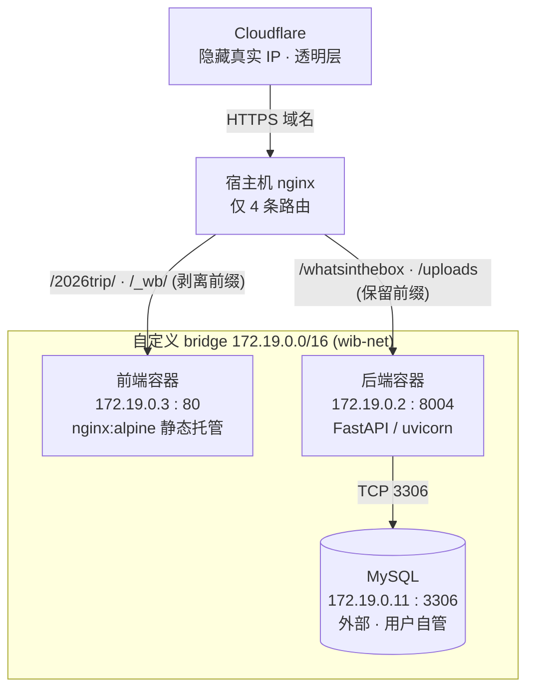
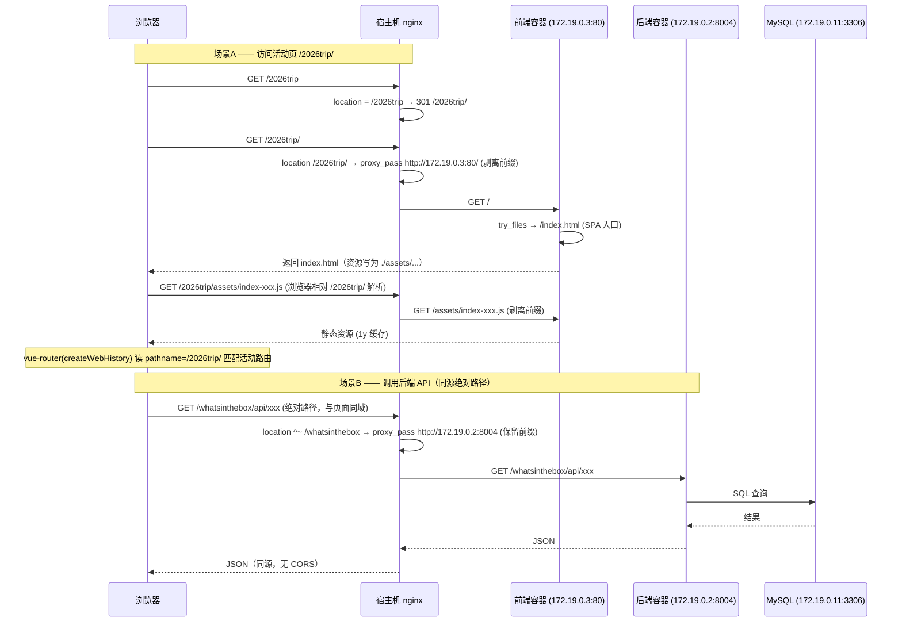
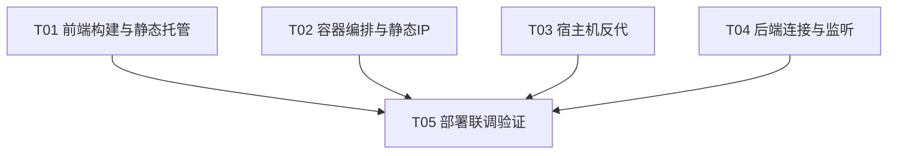

# 系统设计文档：WhatsInTheBox 生产部署

> 角色：架构师（高见远 / Bob）
> 范围：前端编译方式（Vite base 策略）+ 内外层 nginx 反向代理配置 + docker-compose 静态 IP 编排
> 说明：本文档只做**设计与任务分解**，不落地部署文件（由工程师依本文编写）。纯部署任务，无业务类/数据结构设计（第 4 节略）。

---

## 1. 实现方案 + 框架选型

### 1.1 核心决策（确认团队初步建议）

| 决策点 | 结论 | 一句话理由 |
|--------|------|-----------|
| Vite `base` | **`'./'`（相对路径）** | 让 `index.html` 资源以 `./assets/...` 加载，浏览器按当前前缀（`/2026trip/` 或 `/_wb/`）解析，**资源自动落在外层已路由的前缀内**，避开“外层无 `/assets` 路由→404”的死穴。 |
| 外层→前端 | **剥离前缀** `proxy_pass http://172.19.0.3:80/;` | 带 URI 斜杠 → 去掉 `/2026trip`、`/_wb` 前缀，内层 nginx 始终按根 `/` 提供 SPA + history 回退。 |
| 外层→API | **保留前缀** `proxy_pass http://172.19.0.2:8004;`（不带 URI） | 原样传递 `/whatsinthebox`、`/uploads` 给后端，后端路由即挂在此前缀下。 |
| 内层前端 nginx | **只做静态托管** | 删除 `/whatsinthebox`、`/uploads` 反代块（外层已直连后端）；保留 root + `try_files … /index.html` + `/assets` 长缓存 + gzip。 |
| docker-compose | **自定义 bridge + 静态 IP + 不发布端口** | frontend `172.19.0.3`、backend `172.19.0.2`；宿主机 nginx 直接 `proxy_pass` 容器 IP，无需 `ports` 映射。 |
| backend/.env | `DB_HOST=172.19.0.11`、`DB_PORT=3306` | 对接外部自管 MySQL（同网段）。 |

### 1.2 框架 / 选型

- **前端**：沿用 Vue3 + Vite + TypeScript + ant-design-vue；`vue-router` 维持 `createWebHistory()`、无 base（路由自身已能匹配 `/2026trip` 与 `/_wb` 两个入口前缀）。构建产物 `frontend/dist`，多阶段 `node:22-alpine` → `nginx:alpine`。
- **内层代理**：`nginx:alpine` 官方镜像，仅静态托管。
- **外层代理**：宿主机原生 nginx（默认 `nginx:alpine` 行为一致），4 条 `location` 直连容器 IP。
- **编排**：Docker Compose 自定义桥接网络 `172.19.0.0/16` + 静态 IP。
- **新增依赖**：**无**（nginx 用官方镜像，Vite 仅配置项变更，未引入新包）。

### 1.3 备选方案与论证

| 方案 | 做法 | 结论 | 否决原因 |
|------|------|------|---------|
| A. `base: '/'` | 资源绝对路径 `/assets/...` | ✗ | 外层只路由 `/2026trip`、`/_wb`，**不路由 `/assets`** → 资源 404。 |
| B. `base: '/2026trip/'` | 固定单前缀 | ✗ | 仅 `/2026trip` 前缀可用，`/_wb` 失效——无法“同一份产物挂两个前缀”。 |
| C. `base: '/_wb/'` | 固定单前缀 | ✗ | 同上，反向只覆盖 `/_wb`。 |
| D. 外层给每个活动名加 `/<活动>/assets/` 路由 | 放行 `/assets` | ✗ | 活动名可变且由用户后期添加，无法预先穷举；违反“外层只 4 条”约束。 |
| E. 运行时动态 base（`<base href>` 或注入 `import.meta.env.BASE_URL`） | 启动时按域名路径设置 base | △ | 能解双前缀，但需改 SPA 启动逻辑、增加复杂度，收益有限。 |
| **F. `base: './'`（相对路径）** | 资源相对当前文档 URL | ✅ | **唯一干净解法**：同一份构建自动适配 `/2026trip/`、`/_wb/` 两个前缀，且资源落在外层已路由前缀内。 |

> 结论：采用 **方案 F**。补充 1.4 的兜底以修复其唯一已知短板（history 深链直接加载）。

### 1.4 已知限制与兜底（相对 base 的 history 深链）

`base: './'` 下，资源 URL 相对**当前文档路径**解析：
- 入口 `/2026trip/` → `./assets` 解析为 `/2026trip/assets/...` ✅（外层 `location /2026trip/` 命中并转发）
- 深链**直接硬加载** `/2026trip/detail/123` → 浏览器把 `./assets` 解析为 `/2026trip/detail/123/assets/...` ❌（外层转发后内层无此资源）

**兜底（外层 nginx 一行 rewrite，见第 3 节 `deploy/host-nginx-wib.conf`）**：把任意深度的 `/<前缀>/<任意>/assets/` 归一化回 `/assets/`。因 Vite 所有带 hash 资源都固定在顶级 `/assets`，该 rewrite 只命中“被误解析的深链资源”，对顶级 `/assets` 与正常路由无副作用。若团队坚持“最干净”版本，可删此 rewrite（代价：深链硬加载时资源 404，但 SPA 内跳转不受影响）。

> **⚠️ nginx 语义坑（已由 software-engineer 在落地时修正）**：`location` 内若存在 `rewrite … break` 且 `proxy_pass` 带 URI（尾斜杠），nginx 会**忽略 proxy_pass 的 URI、把改写后的完整 URI 原样发给上游**。因此 rewrite 必须**自己把前缀剥掉**、直接产出内层期望的 `/assets/...`，而不能写成“保留前缀、指望 proxy_pass 去剥”。错误写法 `rewrite ^(/2026trip/).*/(assets/.*)$ $1$2 break;` 命中后上游收到 `/2026trip/assets/...`（内层无此路径 → 回退 index.html 返回 HTML 冒充 JS，更隐蔽的故障）；正确写法 `rewrite ^/2026trip/.*/(assets/.*)$ /$1 break;` 自己直出 `/assets/...`。

---

## 2. 网络拓扑图



> 注：后端容器内部端口即 `8004`（不再是 `8004:8000` 映射），外层 `proxy_pass http://172.19.0.2:8004` 直连。MySQL 不在 compose 内，须与本网络同网段且可达（见第 9 节）。

---

## 3. 文件清单及相对路径

> 操作：`修改` = 现有文件改动；`新增` = 工程师新建；`核对` = 确认无需大改但需检查。

| 路径 | 操作 | 说明 |
|------|------|------|
| `frontend/vite.config.ts` | **修改** | 顶层新增 `base: './'`（仅影响资源 URL，不动 `server.proxy` 的 dev 代理，不动 `VITE_API_BASE`）。 |
| `frontend/nginx.conf` | **修改** | 删除 `/whatsinthebox`、`/uploads` 反代块；保留 `/assets` 长缓存 + `try_files … /index.html` + gzip。 |
| `frontend/Dockerfile` | **核对** | 多阶段正确；`ARG VITE_API_BASE=/whatsinthebox`、`EXPOSE 80`、COPY nginx.conf 均无需改。 |
| `docker-compose.prod.yml` | **修改** | 自定义桥接网络 `wib-net`(172.19.0.0/16) + 静态 IP（frontend .3 / backend .2）+ **删除 `ports`** + backend `env_file`。 |
| `deploy/host-nginx-wib.conf` | **新增** | 宿主机反向代理 4 条路由（剥离/保留前缀 + 精确前缀 301 + 深链 rewrite 兜底）。供用户安装到机器。 |
| `deploy/install-host-nginx.sh` | **新增** | 软链 conf 到 `/etc/nginx/conf.d/` 并 `nginx -t` + `reload` 的安装助手脚本。 |
| `backend/.env` | **修改** | `DB_HOST=172.19.0.11`（原 `10.4.215.193`）、`DB_PORT=3306`；`API_PREFIX`/`UPLOAD_URL_PREFIX`/`GLOBAL_PREFIX` 保持。 |
| `backend/Dockerfile` | **修改** | `EXPOSE 8000` → `EXPOSE 8004`；`uvicorn … --port 8000` → `--port 8004`（**关键修正**：无端口映射后容器须自监听 8004）。 |
| `backend` 配置模块（如 `app/core/config.py`） | **核对** | 确认读取 `API_PREFIX=/whatsinthebox`、`UPLOAD_URL_PREFIX=/uploads`、`GLOBAL_PREFIX=_wb`；CORS 同源无需配（见第 8 节）。 |
| `docs/system_design.md` | **新增** | 本设计文档（架构师产出）。 |
| `docs/sequence-diagram.mermaid` | **新增** | 第 5 节时序图源文件。 |

---

## 4. 数据结构与接口

纯部署任务，无业务类 / 数据结构 / API 契约设计，**本节略**。

---

## 5. 程序 / 请求调用流程

### 5.1 时序图



### 5.2 文字说明

1. **资源如何落在已路由前缀内**：Vite `base:'./'` 使 `index.html` 内资源引用为 `./assets/index-xxx.js`。浏览器在 `/2026trip/` 下加载该 HTML 时，相对当前路径解析为 `/2026trip/assets/index-xxx.js`；外层 `location /2026trip/` 命中并把 `/2026trip` 前缀剥离后转发给内层 → 内层收到 `/assets/index-xxx.js` → 命中 `/assets/` 长缓存块返回。**同理 `/_wb/` 入口资源解析为 `/_wb/assets/...`**。两个入口前缀都已被外层路由覆盖，故资源永不触发“外层无 `/assets` 路由”的 404。
2. **SPA history 回退如何工作**：外层对前端前缀做“剥离前缀”后，内层 nginx 始终按根 `/` 提供：未匹配到真实文件的路径（如 `/dashboard`）经 `try_files $uri $uri/ /index.html` 回退到 `index.html`，由 `vue-router` 按 `pathname` 接管。由于外层已剥离前缀，`/_wb/dashboard` 在内层看来就是 `/dashboard`，回退逻辑与单域名部署完全一致。
3. **API 为何不经前端容器**：浏览器 `fetch('/whatsinthebox/...')` 是**域名根绝对路径**，直接打到外层 nginx → `location ^~ /whatsinthebox` 保留前缀直连 `172.19.0.2:8004`，**前端容器永远收不到 `/whatsinthebox`**，故内层 `nginx.conf` 的反代块是死代码，删除即可。
4. **同源免 CORS**：页面（`domain.com/2026trip/`）与 API（`domain.com/whatsinthebox/`）scheme/host/port 完全一致 → 同源，浏览器不触发 CORS（详见第 8 节）。

---

## 6. 任务列表（有序、含依赖、按实现顺序）

> 由团队原始 T1–T6 **收敛为 5 个任务**（满足“同一功能模块分组、每任务≥3 相关文件、首个为基础设施类、总数≤5”的分解纪律）。映射关系：
> T01←{T1,T2}｜T02←{T4 网络部分}｜T03←{T3}｜T04←{T5,后端Dockerfile}｜T05←{T6 验证}。

| Task ID | Task Name | Source Files | Dependencies | Priority |
|---------|-----------|--------------|--------------|----------|
| **T01** | 前端构建与静态托管配置 | `frontend/vite.config.ts`、`frontend/nginx.conf`、`frontend/Dockerfile` | 无 | **P0** |
| **T02** | 容器编排与静态 IP 网络 | `docker-compose.prod.yml`、`deploy/DEPLOY.md`、`backend/.env`(网络相关备注) | 无 | **P0** |
| **T03** | 宿主机反向代理配置 | `deploy/host-nginx-wib.conf`、`deploy/install-host-nginx.sh` | 无 | **P0** |
| **T04** | 后端连接与监听配置 | `backend/.env`、`backend/Dockerfile`、`backend` 配置模块（前缀/CORS 核对） | 无 | **P1** |
| **T05** | 部署联调与验证 | 覆盖 T01–T04 全部部署文件（冒烟 + QA 清单） | T01, T02, T03, T04 | **P0** |

**实现顺序建议**：T01→T04 可并行（互不依赖），T02/T03 仅依赖“IP 方案已定”这一决策（已定，可并行编写），最后 T05 统一联调。

### 6.1 任务依赖图



---

## 7. 依赖包列表

**无新增第三方依赖。**
- 前端运行时：Vue3 / Vite / TypeScript / ant-design-vue（现有）。
- 代理：nginx 官方镜像（`nginx:alpine`），纯配置。
- 编排：Docker Compose 原生能力。
- Vite 仅变更 `base` 配置项，未引入新包。

---

## 8. 共享知识（跨文件约定）

1. **Vite `base` 与 `VITE_API_BASE` 正交**：
   - `base: './'` → **构建期**决定 `index.html` 里资源（JS/CSS）的引用方式（相对路径）。
   - `VITE_API_BASE=/whatsinthebox` → **运行时**决定 `fetch` 的 API 绝对路径（`/whatsinthebox`、`/uploads`）。
   - 二者互不影响：改 `base` 不会动 API 调用，API 调用也始终以域名根绝对路径直连外层 nginx。
2. **4 条外层路由与内层 SPA 回退的对应**：
   - `/2026trip`、`/_wb` → 前端（剥离前缀，内层按根 `/` 提供 SPA + `try_files … /index.html` 回退）。
   - `/whatsinthebox`、`/uploads` → 后端（保留前缀，后端路由挂在此前缀下）。
   - 内层前端 nginx **不含**任何 API 反代块。
3. **MySQL IP 约定**：`172.19.0.11:3306`，外部自管；后端经 `DB_HOST`/`DB_PORT` 连接，后端容器须能路由到该 IP（同网段 / 已挂网）。
4. **同源免 CORS**：页面与 API 同域（均在域名根下），浏览器→API 同源请求**不触发 CORS**；`CORS_ORIGINS` 仅在未来跨域（独立子域 / 不同域）时才需配置。
5. **精确前缀 301**：`/2026trip`→`/2026trip/`、`/_wb`→`/_wb/`，避免无尾斜杠时相对资源（`./assets`）被解析到错误路径。
6. **容器端口语义变更**：本部署**移除 `ports` 映射**，故“容器内部监听端口 = 外层 `proxy_pass` 目标端口”。后端须监听 `8004`（非 8000），前端监听 `80`。

---

## 9. 待明确事项（需用户 / 团队确认）

1. **宿主机 nginx 形态**：原生安装在宿主机，还是也跑在 docker 内？若是 docker 内，须将其挂到 `wib-net` 或用 `host` 网络，否则无法访问 `172.19.0.x` 容器 IP。当前设计按“宿主机原生 nginx”假设。
2. **精确前缀 301**：`/2026trip`→`/2026trip/`、`/_wb`→`/_wb/` 是否需要？（建议需要，避免相对资源解析错误）当前已按“需要”设计。
3. **CORS_ORIGINS**：是否需把前端域名加入？当前同源无需；若将来前端用独立子域或 Cloudflare 不同域，需加。
4. **MySQL 网络归属（重要）**：`172.19.0.11` 是否在 `wib-net`（`172.19.0.0/16`）同一自定义桥接网络？若 MySQL 是独立容器/外部主机，后端需能路由到该 IP（挂同网或 `network_mode: host`）。需用户确认 MySQL 的网络接入方式。
5. **活动名扩展性**：`/2026trip` 为示例，将来活动名变化是否需要外层 nginx 同步加 `location`？目前按“用户单独加，默认仅这 4 条”处理。
6. **上传大小**：`/uploads` 的 `client_max_body_size` 取多少（当前设计暂定 `20m`）？需与 `backend/.env` 的 `MAX_UPLOAD_MB=5` 对齐或放大。
7. **TLS 终止位置**：Cloudflare 是否已终止 TLS、内层是否纯 http？当前内层 `proxy_pass` 用 `http://`，按“Cloudflare→外层 nginx(https)→容器(http)”假设；若外层也需 https，请补充证书配置。
8. **深链兜底取舍**：第 1.4 节的 `rewrite` 兜底是否保留？（推荐保留，零副作用，修复 history 深链硬加载资源 404）

---

## 附：关键配置片段（供工程师直接落地）

**`frontend/vite.config.ts`（新增 `base`）**
```ts
export default defineConfig({
  base: './',            // ← 新增：相对路径，资源落在已路由前缀内
  plugins: [vue()],
  resolve: { alias: { '@': fileURLToPath(new URL('./src', import.meta.url)) } },
  server: {
    port: 5176,
    proxy: {
      '/whatsinthebox': { target: PROXY_TARGET, changeOrigin: true, /* … */ },
      '/uploads': { target: PROXY_TARGET, changeOrigin: true },
    },
  },
})
```

**`frontend/nginx.conf`（删除 API 反代块）**
```nginx
server {
    listen 80; server_name _;
    root /usr/share/nginx/html; index index.html;
    location /assets/ { expires 1y; add_header Cache-Control "public, immutable"; try_files $uri =404; }
    location / { try_files $uri $uri/ /index.html; }
    gzip on; gzip_types text/plain text/css application/json application/javascript text/xml application/xml image/svg+xml; gzip_min_length 1024;
}
```

**`deploy/host-nginx-wib.conf`（宿主机 4 条路由）**
```nginx
location = /2026trip { return 301 /2026trip/; }
location = /_wb     { return 301 /_wb/; }

location /2026trip/ {
    # ⚠️ rewrite 命中时 proxy_pass 的 URI 会被忽略，故此处自行剥前缀、直出 /assets/...
    rewrite ^/2026trip/.*/(assets/.*)$ /$1 break;   # 深链资源兜底
    proxy_pass http://172.19.0.3:80/;
    proxy_set_header Host $host; proxy_set_header X-Real-IP $remote_addr;
    proxy_set_header X-Forwarded-For $proxy_add_x_forwarded_for;
    proxy_set_header X-Forwarded-Proto $scheme;
}
location /_wb/ {
    rewrite ^/_wb/.*/(assets/.*)$ /$1 break;        # 同上，/_wb/ 前缀
    proxy_pass http://172.19.0.3:80/;
    proxy_set_header Host $host; proxy_set_header X-Real-IP $remote_addr;
    proxy_set_header X-Forwarded-For $proxy_add_x_forwarded_for;
    proxy_set_header X-Forwarded-Proto $scheme;
}

location ^~ /whatsinthebox {
    proxy_pass http://172.19.0.2:8004;
    proxy_set_header Host $host; proxy_set_header X-Real-IP $remote_addr;
    proxy_set_header X-Forwarded-For $proxy_add_x_forwarded_for;
    proxy_set_header X-Forwarded-Proto $scheme; proxy_read_timeout 60s;
}
location ^~ /uploads {
    proxy_pass http://172.19.0.2:8004;
    proxy_set_header Host $host; proxy_set_header X-Real-IP $remote_addr;
    proxy_set_header X-Forwarded-For $proxy_add_x_forwarded_for;
    proxy_set_header X-Forwarded-Proto $scheme;
    client_max_body_size 20m; proxy_read_timeout 120s;
}
```

**`docker-compose.prod.yml`（摘要）**
```yaml
name: whatsinthebox-prod
networks:
  wib-net:
    driver: bridge
    ipam: { config: [ { subnet: 172.19.0.0/16 } ] }
services:
  backend:
    build: { context: backend, dockerfile: Dockerfile }
    image: whatsinthebox-backend:prod
    env_file: [ backend/.env ]
    networks: { wib-net: { ipv4_address: 172.19.0.2 } }
    restart: unless-stopped
  frontend:
    build: { context: frontend, dockerfile: Dockerfile }
    image: whatsinthebox-frontend:prod
    networks: { wib-net: { ipv4_address: 172.19.0.3 } }
    depends_on: [ backend ]
    restart: unless-stopped
  # MySQL 172.19.0.11:3306 外部自管，不在 compose 内
```

**`backend/Dockerfile`（端口修正）**
```dockerfile
EXPOSE 8004
CMD ["uvicorn", "app.main:app", "--host", "0.0.0.0", "--port", "8004", "--workers", "4"]
```

**`backend/.env`（DB 段）**
```env
DB_HOST=172.19.0.11
DB_PORT=3306
# 其余（DB_USER/DB_PASSWORD/DB_NAME/GLOBAL_PREFIX/API_PREFIX/UPLOAD_URL_PREFIX…）保持不变
```
